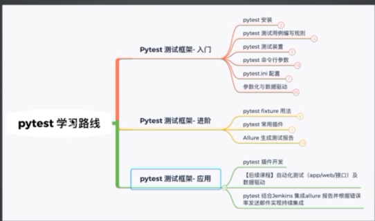

# 一、知识点梳理

    pytest:单元测试框架，也支持集成测试（UI、接口、WEB）

# 实战一：测试数据的数据驱动

    说明：
    
    1.数据可以保存到yaml，excel，json，建议使用yaml，yaml很多开元框架都支持
    
    2.yaml支持格式较多，类似于json，可以以key和value的形式保存数据
    
    3.yaml不限语言，无论使用什么语言，传yaml数据都可以解析

## 实战一：实现数据驱动

## 1.创建数据文件:保存测试数据
    文件夹：datas

## 2.创建解析文件方法:解析yaml中的数据

    '''获取yaml 数据'''
    def get_adddata(name,level):
        # 读取文件通过相对路径的话，相对路径通常在根目录运行项目的时候，会报错路径不对
        # os.path.abspath()
        # with open("../../datas/test_add_data.yaml",encoding="utf-8") as f:
    
        # 调用获取绝对路径的方法get_yaml_path()
        with open(get_yaml_path(),encoding="utf-8") as f:
            # safe_load()将yaml格式转成python对象
            result = yaml.safe_load(f)
        print(result)
        # P0测试数据
        data = result.get(name).get(level).get('data')
        # P0测试用例别名
        ids = result.get(name).get(level).get('ids')
        print(f"测试数据 = {data}",f"\n测试用例别名 = {ids}")
        return data,ids
    
    '''通过绝对路径获取到yaml文件的路径'''
    def get_yaml_path():
        # __file__ == util.py
        path = os.path.abspath(__file__)
        demo_path = os.path.dirname(path)
        yaml_path = "datas/test_add_data.yaml"
        yaml_finalpath = os.path.join(demo_path,"../",yaml_path)
        return yaml_finalpath

## 3.用例中使用解析之后的数据
    test_add_params.py 
        add_P0_data = get_adddata("add","P0")[0]
        add_P0_ids = get_adddata("add","P0")[1]

## 4.执行完所有的用例，打印日志:清理所有的测试数据

    '''清理测试数据'''
    autouse=True 自动执行
    scope="session"作用域
    yield 前相当于setup 后相当于teardown
    @pytest.fixture(autouse=True,scope="session")
    def clear_datas():
        yield
        logger.info("清理所有的测试数据")

# 实战二：合理使用第三方插件实现特殊需求
    **假设每条用例执行需要5秒，加速执行用例(速度提升一倍以上)**
    安装插件(并发执行插件)：pip install pytest-xdist
    pytest -vs -n 3  # 3指的是进程数
    pytest -vs -n auto # 不确定进程数

    **调整执行用例的顺序，先执行add PO级别和div PO级别，再执行add P1级别和divP1**
    PS：测试顺序一般不建议添加
    pytest install pytest-ording
    @pytest.mark.run(order = 1) # order = 1 指作为第一次个执行用例

    **级别(addPO>divPO> addP1>divP1)**
    
    **.如果PO级别的用例执行失败，则重新尝试执行最多3次，如果执行成功则只执行一次**
    pip install rerunfailures
    pytest --reruns 5 # 所有的用例执行失败后，都会重先执行
    pytest --reruns 5 --reruns-delay 1 #每个用例执行之间的间隔时间
    @pytest.mark.flaky(reruns = 5,delay = 1) # 指定级别用例，添加装饰器，失败后重试5次

    **生成测试报告(添加用例分类，添加测试步骤，添加图像<本地任意图片>)**
    用例分类
        @pytest.fixture("登录") # 大分类
        @pytest.story("P0") # 小分类
    测试步骤
        with allure.step("步骤1")
    添加图像
        allure.attach.file("路径/路径/路径/")

    

# FAQ
    1.项目层级过多时，在test目录执行pytest -vs运行测试项目时报错，ModuleNotFoundError: No module named 'learn.pytest1'
